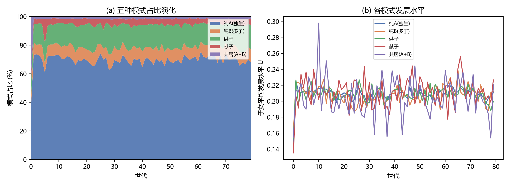
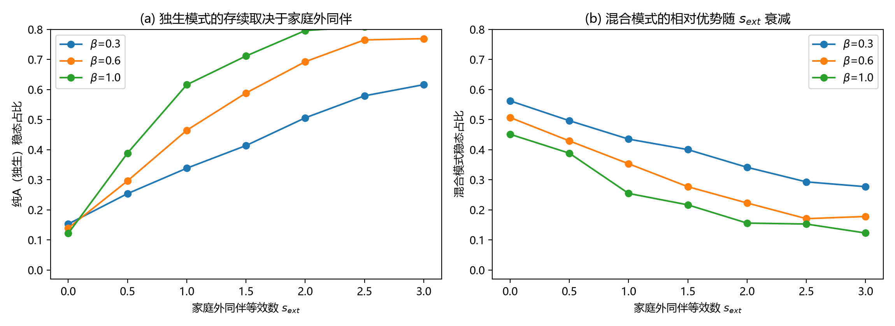
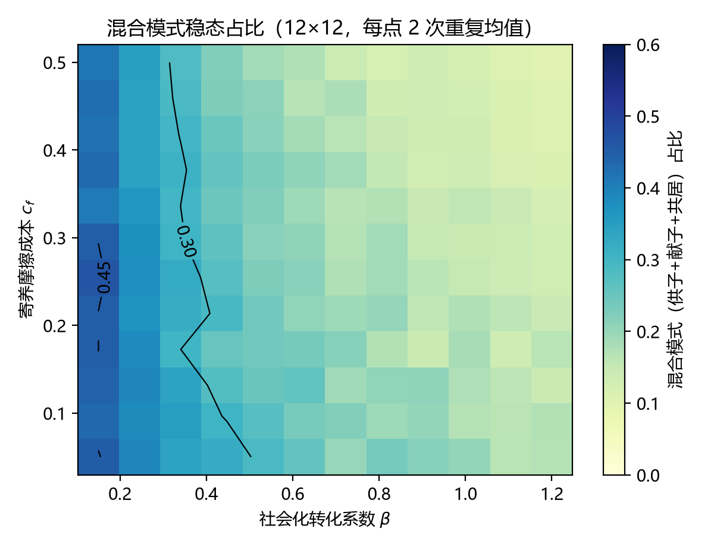
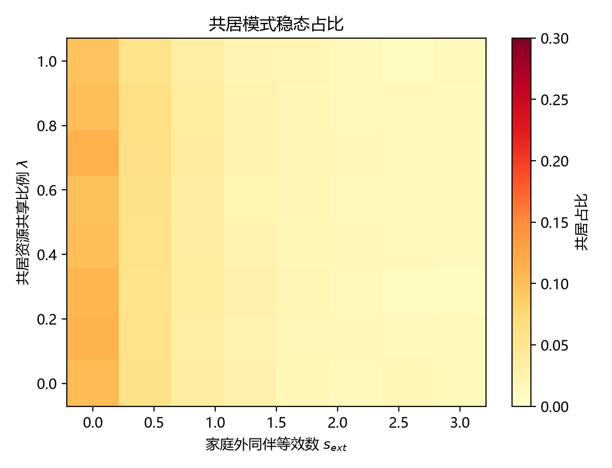

# 独生与多子混合家庭模式的社会意义——基于集合论组合与计算模拟的理论建构（v2 修订版）

> 修订说明：本版修正了初稿中 7 处可验证的数学错误（尤其"独生子女社会化为零"导致 `U_A≡0` 的硬错误），
> 并用可复现的多主体模拟（`code/abm.py`，300 家庭 × 80 代 × 5 次重复）替换了原稿中未运行的模拟方案。
> 模拟结果使论文的核心结论发生**实质变化**：混合模式并非普遍占优，其占优与否取决于"家庭外同伴能否替代同胞"。
> 详细修订对照见 `docs/修订对照表.md`。

## 摘要

独生家庭与多子家庭长期被视为互斥的两种养育策略。本文将独生家庭的养育场域记为集合 $A$、多子家庭的养育场域记为集合 $B$，用"场域隶属度"刻画儿童同时处于两类场域的程度，并区分五种组合形态：纯 $A$、纯 $B$、$B$ 家一子进入 $A$ 家（单向寄养）、$A$ 家独子进入 $B$ 家（反向寄养）、$A$ 与 $B$ 两户共居。本文将养育场域形式化为资源—社会化—摩擦三维效用 $U=R\cdot S\cdot(1-C)$，其中社会化 $S=1-e^{-\beta(s_{ext}+\kappa p)}$ 显式区分**同胞互动** $p$ 与**家庭外同伴** $s_{ext}$。对 300 个家庭、80 代的模拟显示：（1）混合模式能否占优由 $s_{ext}$ 与 $\beta$ 共同决定——当家庭外同伴无法替代同胞（$s_{ext}\to 0$）时，混合模式占比达 0.28~0.56；当 $s_{ext}\ge 2$ 时，纯独生回升至 0.62~0.85，混合模式退为少数形态；（2）共居模式即使在资源共享比例 $\lambda=0$（只共享育儿场域、不合并财产）时稳态占比也不超过 11.3%，因为共居对独生家庭儿童是资源净损失，**不构成帕累托改进**；（3）真正能存续的混合形态是**单向寄养**，它依赖接收方家庭的利他开放度与既有子女数。本文的结论是：混合家庭不是家庭演化的必然终点，而是一种**条件性制度安排**；其可行性取决于社会能否为跨家庭养育提供低摩擦环境，以及社区同辈网络能否部分替代同胞的功能。

**关键词**：独生子女；多子女家庭；混合家庭；资源稀释；同胞社会化；多主体模拟

---

## 一、问题提出

独生子女政策实施三十余年间，中国社会形成了人类历史上规模最大的独生子女群体。围绕"独生子女是否更优"的争论自 1980 年代延续至今，大体沿两条对立线索展开：一条强调独生子女的资源优势——父母时间、经济投入与教育期望高度集中（Falbo & Polit, 1986）；另一条强调其社会化缺陷——缺乏同胞互动导致社交技能不足（朱赫等，2023）。多子女家庭则被置于光谱另一端：资源稀释理论认为家庭资源随子女数增加而被摊薄（Blake, 1981；方超等，2020），但同胞关系本身提供了独特的社会化训练场（朱赫等，2023）。

然而既有研究几乎毫无例外地把"独生"与"多子"当作互斥类型，预设了一个隐含前提：一个家庭要么是 $A$ 型，要么是 $B$ 型。本文的起点是一个更弱、也更容易验证的追问：**在什么条件下，儿童可以同时处于资源集中的 $A$ 场域与同胞互动充分的 $B$ 场域？**

这一"混合"并非纯粹的思想实验。在中国农村，父辈分配宅基地、多个已婚子家庭在同一院落生活，使独生子女与多子女儿童共享祖辈关注、共餐与资源分配规则；在民间习俗中，多子家庭将一子送至独生亲属家庭寄宿、或独生家庭将独子送至多子家庭生活一段时间，都有历史与现实依据；西方儿童福利体系中的亲属寄养（kinship care）研究同样表明，把儿童安置在亲属家庭是一种介于原生家庭与机构照护之间的中间形态（Dubowitz et al., 1992; Sawyer & Dubowitz, 1994）。

但**现象存在不等于均衡存在**。本文因此提出三个递进目标：第一，用集合论语言刻画两种养育场域的组合形态，并把"子集关系"这一误用修正为可度量的"场域隶属度"；第二，把养育场域形式化为 $U=R\cdot S\cdot(1-C)$，推导资源稀释、社会化转化与摩擦成本对模式选择的比较静态影响，并给出混合模式构成帕累托改进的**可检验条件**；第三，用可复现的多主体模型检验：在代际选择压力下，混合模式是否会成为主导形态，以及它依赖哪些条件。

需要预先申明本文的立场：本文是**分析性类型学与条件性推演**，不是规范性主张。它不主张把儿童送离原生家庭更好，也不把儿童视为可配置的资源；本文恰恰要说明，混合安排在什么条件下对儿童有利、在什么条件下会损害儿童（见 §6.4）。

---

## 二、文献回顾：两类家庭的优势与困境

### （一）独生子女家庭：资源集中与家庭外同伴的替代作用

Falbo 与 Polit（1986）综合 115 项研究，在智力、成就、性格、社会性与适应五个维度比较独生子女与非独生子女，结果与"缺失假说"的预期相反：独生子女在成就与智力上显著优于大家庭子女，在社会性与适应上与非独生子女无显著差异；元分析支持"父母—子女关系机制"——独生子女与父母的关系质量更好，密集关注转化为成就动机与认知发展。中国语境中的部分证据与此一致：杨菊华（2008）发现独生子女失学概率更低；方超等（2020）基于 CEPS 发现家庭规模扩大会负向冲击学业成绩；韩雷与钟静芙（2023）则指出独生子女在**客观行为**上的尽责性得分更低，原因之一是其较少参与家务。

这里存在一个对本文至关重要的区分：既有研究普遍把独生子女的"社会化劣势"归因于缺少同胞，但**独生儿童并非没有同辈互动**——学校、社区、邻里构成了家庭外的同伴网络。因此社会化水平应写成"同胞互动 + 家庭外同伴"的联合函数，而非同胞的单调函数。初稿曾令独生子女的社会化 $S_A=0$，这在经验上不成立，在模型上会导致 $U_A\equiv 0$（见 §4.2 的说明）：**独生子女的处境不是"零社会化"，而是"社会化来源不同、可控性更低"**（家庭外同伴的质量取决于学校与社区，不如同胞关系稳定）。这一区分是本文最终结论反转的直接原因。

### （二）多子女家庭：同胞社会化与资源稀释

多子女家庭呈现双面性。朱赫等（2023）利用 2021 年全国九省青少年调查发现，非独家庭更有助于增强儿童社交能力，家庭子女数越多，儿童校园交友数越多，且该效应受家庭经济条件正向调节。另一面是资源稀释：Blake（1981）提出家庭经济、人力与社会资本在子女间分配时每增加一个孩子就摊薄一份；方超等（2020）验证了非货币性教育人力资本投资与生育意愿的反向运动；杨菊华（2008）也发现教育机会随姊妹数与兄长存在而下降。陈自芳（2005）从供求角度概括：独生家庭"供给过度而互动不足"，多子家庭"互动充分而供给分散"——两类家庭的困境恰成镜像。

### （三）研究空白

综上，既有研究已分别刻画 $A$、$B$ 两类家庭的优劣，但存在两个空白：第一，绝大多数研究把 $A$ 与 $B$ 视为互斥类别，缺乏对"混合"形态的理论概念化；第二，人类学与人口学研究虽记录了中国农村大家庭共居（王雅林和张汝立，1995；王跃生，2003；杜园园和苏柱华，2020）与亲属寄养（Dubowitz et al., 1992），但主要描述现象本身，未将其提升为可与独生/多子二元框架对话的类型学，也未建立形式化模型比较不同组合模式的系统绩效，更未检验混合模式是否在演化意义上稳定。本文试图填补这三个空白。

---

## 三、概念框架：场域组合的五种形态

### （一）场域与隶属度：对"子集"表述的修正

初稿用 $B\subseteq A$ 表示"多子家庭的一子进入独生家庭"，这一写法在集合论上不成立：若 $B\subseteq A$，则 $B$ 家**所有**儿童都属于 $A$ 场域，而现实中只有一名儿童进入。正确的刻画是**部分重叠**。

设：
- $F_A$：独生家庭提供的养育场域（资源集中、无同胞）；
- $F_B$：多子家庭提供的养育场域（同胞充分、资源稀释）；
- 儿童 $i$ 对场域 $F$ 的**隶属度** $\mu_i(F)\in[0,1]$ 表示其在该场域中实际生活与汲取资源的程度。

于是混合的本质是 $\mu_i(F_A)>0$ 且 $\mu_i(F_B)>0$，即 $i$ 同时隶属两个场域。在此基础上，五种具有社会学意义的组合是：

| 组合 | 隶属度刻画 | 含义 | 现实对应 |
|---|---|---|---|
| 一 | $\mu(F_A)=1,\ \mu(F_B)=0$ | 纯 $A$：全程仅处独生场域 | 城市核心家庭 |
| 二 | $\mu(F_A)=0,\ \mu(F_B)=1$ | 纯 $B$：全程仅处多子场域 | 传统多子女农村家庭 |
| 三 | $B$ 家某子 $\mu(F_A)=\theta,\ \mu(F_B)=1-\theta$ | 单向寄养（$B\to A$） | 多子家庭送一子到独生亲属家就读/寄养 |
| 四 | $A$ 家独子 $\mu(F_B)=\delta,\ \mu(F_A)=1-\delta$ | 反向寄养（$A\to B$） | 独生子到多子亲属家生活一段时间 |
| 五 | 两户儿童同时 $\mu(F_A)>0,\mu(F_B)>0$ | 共居：$A$、$B$ 两户同一屋檐/院落生活 | 宅基地分配下的大家庭共居 |

必须明确：**这五种不是集合论意义上的穷尽枚举**（$A=B$、$A\cap B=\varnothing$ 等形式在集合论上同样存在，但在家庭情境中缺乏意义），而是"在社会学上具有解释力"的五种形态。初稿声称五者"构成完整的逻辑空间"，此说需撤回。

### （二）三种现实形态的经验基础

**1. 共居（组合五）**：王雅林和张汝立（1995）指出北方农村家庭"生产和生活、初级群体和生产经营组织的统一"特征，使大家庭与小家庭统分结合的形式普遍存在；宅基地由父辈掌握，多个已婚儿子各自成家但仍在同一院落或邻近区域生活。杜园园和苏柱华（2020）对珠三角 S 村"钟摆式家庭"的研究进一步显示，集体经济分配与宗族文化共同强化了以父子关系为主轴的家庭伦理秩序，不同父辈的小家庭共享同一套资源分配规则——儿童自然处于混合场域。

**2. 单向寄养（组合三、四）**：在教育资源不均衡地区，多子家庭为让孩子获得更好教育而送至城镇独生亲属家；计划生育时期部分多子家庭曾将孩子寄养在无子女或独生亲属家（**此现象涉及规避政策，本文仅作为历史事实陈述，不构成正当性论证**）。西方最接近的概念是亲属寄养，Sawyer 与 Dubowitz（1994）发现亲属寄养儿童的学业表现存在一定劣势，但安置年龄较晚、寄养家庭子女数较少时表现更好——这间接提示"儿童数更少、资源更充裕的接收家庭"可能产生积极效应。

**3. 反向寄养（组合四）**：独生家庭父母意识到孩子缺乏同胞互动，主动将其送至多子亲属家生活一段时期，以获得同伴交往与生活自理训练。传统社会中"寄读""寄养"及部分过继安排包含类似逻辑（注意：过继在我国《民法典》中受收养制度规范，须履行法定程序）。

---

## 四、形式化模型

### （一）养育场域的三维效用

设子女在养育场域中的发展水平由三个维度共同决定：

$$U = R \cdot S \cdot (1 - C)$$

其中 $R\in[0,1]$ 为可获得的**人均资源**，$S\in[0,1]$ 为**社会化水平**，$C\in[0,1]$ 为跨家庭安排带来的**摩擦成本**。三个维度均归一化到 $[0,1]$，故 $U\in[0,1]$。取乘积形式（而非加权和）的理由是三维具有**互补性**：资源再充足，若社会化渠道被切断，发展水平仍受抑制；反之亦然。函数形式（如加权和形式）的敏感性有待后续检验，见 §5.5。

社会化水平设定为"互动对象数量的饱和函数"：

$$S = 1 - e^{-\beta(s_{ext} + \kappa p)}$$

$p$ 为同胞（或场域内）互动对象数，$s_{ext}\ge 0$ 为**家庭外同伴等效数**（学校、社区、邻里中可替代同胞互动的同辈数量），$\beta>0$ 为社会化的转化强度，$\kappa\in(0,1]$ 为关系折损系数——跨家庭关系的互动深度低于同胞关系，故 $\kappa_f<\kappa_c$。

**关于初稿错误的说明**：初稿令 $s_{ext}=0$，得到 $S_A = 1-e^{-\beta\cdot 0}=0$，进而 $U_A\equiv 0$（纯独生家庭效用恒为零）。这在经验上不成立（独生儿童有同学、邻里同伴），在模型上会带来两个后果：一是任何含 $S>0$ 的模式都"无限优于"纯 $A$，比较失去意义；二是临界社会化系数 $\beta^*$ 退化为 0，使"$\beta$ 较小时独生理性"的结论与推导结果自相矛盾。本版显式引入 $s_{ext}$，**独生子女的处境因此被刻画为"社会化来源不同、稳定性更低"，而非"社会化为零"**。

### （二）五种模式的资源、社会化与摩擦

| 模式 | 人均资源 $R$ | 社会化 $S$ | 摩擦 $C$ |
|---|---|---|---|
| 纯 $A$（独生） | $E_A$ | $1-e^{-\beta s_{ext}}$ | $0$ |
| 纯 $B$（多子，$n$ 个子女） | $\dfrac{E_B}{n}\left[1-\alpha(n-1)\right]$ | $1-e^{-\beta(s_{ext}+n-1)}$ | $0$ |
| 单向寄养 $B\to A$（宿主家 $n_h$ 个亲子女） | 外送子：$\theta\dfrac{E_h}{n_h+1}$；留家子（$k=n-1$）：$\dfrac{E_B}{k}\left[1-\alpha(k-1)\right]$ | 外送子：$1-e^{-\beta(s_{ext}+\kappa_f n_h)}$ | $c_f$ |
| 反向寄养 $A\to B$（宿主家 $n_h\ge 2$） | $\delta\dfrac{E_h}{n_h+1}$ | $1-e^{-\beta(s_{ext}+\kappa_f(n_h-1))}$ | $c_f$ |
| 共居 $A$+$B$（伙伴家庭资源 $E_p$、子女数 $n_p$） | $(1-\lambda)\dfrac{E}{n}+\lambda\dfrac{E+E_p}{n+n_p}$ | $1-e^{-\beta(s_{ext}+\kappa_c(n+n_p-1))}$ | $c_c$ |

参数含义：$\alpha$ 资源稀释系数；$\theta\in(0,1]$ 接收家庭对**被寄养儿童**的资源接纳度（$\theta<1$ 表示差别对待）；$\delta\in(0,1]$ 反向寄养中宿主家庭对该儿童的实际分配系数；$\lambda\in[0,1]$ 共居家庭的资源共享比例；$c_f,c_c$ 分别为寄养与共居的摩擦成本。

**关于共居资源式的修正**：初稿写作 $R_{共}=(E_A+\lambda E_B)/(n_A+n_B)$。该式在 $\lambda=0$（即两户完全不共享资源）时仍得到 $R_{共}=E_A/(n_A+n_B)$，意味着 $A$ 家独子的资源被 $B$ 家儿童平摊，与正文所述"各小家庭保留经济独立性"直接矛盾。本版改为互补式：$\lambda=0$ 时 $R_{共}=E/n$（各自独立），$\lambda=1$ 时完全合并。这一修正使"共居"成为一个**连续的制度变量**而非二元选项——这正是政策讨论最关心的问题：**合并到什么程度仍然可行**。

宿主家庭自身的亲子女承担"分母 +1"的稀释：$R^{host}=E_h/(n_h+1)$，同时获得一名跨家庭同伴。宿主家庭对是否接收的权衡用**利他开放度** $o\in[0,1]$ 加权：

$$U^{host} = (1-o)\cdot U^{无接收} + o\cdot U^{接收}$$

$o$ 可理解为亲缘利他与互惠预期的强度，$o$ 越高的家庭越愿意承担稀释损失（模拟中 $o\ge o_{min}=0.30$ 的家庭才成为可能的接收方）。

### （三）比较静态

**1. 稀释系数临界 $\alpha^*$**。令多子家庭子女效用等于某一混合模式的效用 $U_{混}$：

$$\frac{E_B}{n}\left[1-\alpha(n-1)\right]S_B = U_{混} \;\Longrightarrow\; \alpha^* = \frac{1-\dfrac{n\,U_{混}}{E_B S_B}}{n-1}$$

（初稿漏除了 $(n-1)$，量纲与数值均不成立。）

**2. 摩擦成本临界 $c^*$**。由 $U_{混}^{0}(1-c)\ge U_{纯}$（$U_{混}^{0}$ 为无摩擦时的效用）：

$$c^* = 1 - \frac{U_{纯}}{U_{混}^{0}}$$

（初稿写作 $c^*=1-U_{混}/U_{纯}$，分母分子颠倒，会得出"摩擦越大越优"的相反结论。）

**3. 独生—多子无差异的社会化系数 $\beta^*$**。令 $U_A=U_B$：

$$E_A\left(1-e^{-\beta s_{ext}}\right) = \frac{E_B}{n}\left[1-\alpha(n-1)\right]\left(1-e^{-\beta(s_{ext}+n-1)}\right)$$

该式两侧同为 $1-e^{-\beta\cdot}$ 结构，一般无闭式解，需数值求解（令 $x=e^{-\beta}$ 后为 $x$ 的代数方程）。**其关键性质是：当 $s_{ext}=0$ 时左侧恒为 0，方程退化为 $\beta^*=0$。**换言之，"独生子女被淘汰"这一结论并非模型的普遍推论，而是 $s_{ext}=0$ 这一特定假设的产物。$s_{ext}$ 越大，左侧越大，存在使纯 $A$ 反超多子与混合模式的参数区制——这正是 §5.3 区制扫描所验证的核心命题。

**4. 共居可行的资源共享上限 $\lambda^*$**。令共居儿童效用不低于纯独生：$R_{共}(\lambda)S_{共}(1-c_c)\ge E_A S_A$，解出

$$\lambda^* = \frac{\dfrac{E_A S_A}{S_{共}(1-c_c)} - \dfrac{E}{n}}{\dfrac{E+E_p}{n+n_p} - \dfrac{E}{n}}$$

以对称收入（$E=E_p$）、$n=1,\ n_p=3$、$\beta=0.6,\ s_{ext}=2,\ c_c=0.08$ 代入，得 $\lambda^*\approx 0.40$：**两户资源合并比例超过 40% 时，独生家庭的儿童即从共居中受损**。这为"共居未被广泛采用"提供了一个直接的形式化解释。

### （四）帕累托改进的条件（重写）

混合安排 $M$ 构成帕累托改进，当且仅当**各方**均不劣、且至少一方严格改善：

1. **$B$ 家儿童**：$U_M\ge U_B$；
2. **$A$ 家儿童**（共居与反向寄养情形）：$U_M\ge U_A$；
3. **接收方家庭**：$(1-o)U^{无接收}+o\,U^{接收}\ge U_{纯}$，即 $o\ge o^*=\dfrac{U_{纯}-U^{无接收}}{U^{接收}-U^{无接收}}$（分母为负时需 $o\le o^*$）。

须强调，三个条件都是**同一量纲（效用值）之间的比较**，不需要引入"交易成本"这类与效用非同量纲的量；初稿的条件 1（$E_A[S_{混}-0](1-C)\ge E_A\cdot 1\cdot(1-0)$）在 $S_A=0$ 读法下恒成立、在把右侧读作 $E_A$ 时又恒不成立，属自败式写法，予以废弃。

**数值例证**（$E_A=E_B=0.357$，即均值水平；$n=3$，$\theta=0.8$，$\lambda=0.5$，$\beta=0.6$，$s_{ext}=2$，$\kappa_c=1$，$c_c=0.08$）：

- $A$ 家儿童：$R_{共}=0.5\times 0.357+0.5\times\dfrac{0.714}{4}=0.2678$，$S_{共}=1-e^{-0.6\times 5}=0.9502$，故 $U_{共}=0.2678\times 0.9502\times 0.92=0.2341$；纯 $A$ 时 $U_A=0.357\times(1-e^{-1.2})=0.2495$。**$A$ 家儿童受损 6.2%**。
- $B$ 家儿童：$R_{共}=0.5\times\dfrac{0.357}{3}+0.5\times\dfrac{0.714}{4}=0.1488$，$U_{共}=0.1301$；纯 $B$ 时 $R_B=\dfrac{0.357}{3}(1-0.3)=0.0833$，$U_B=0.0833\times 0.9093=0.0757$。**$B$ 家儿童改善 71.8%**。

结论：在对称收入下，共居是**单向受益**的安排——多子家庭儿童获益巨大，独生家庭儿童受损。因此它在演化意义上难以自我维持，除非 $\lambda$ 足够小（只共享育儿场域、不合并财产）或两户收入悬殊（$E_p$ 显著高于 $E$）。这与模拟中共居模式稳态占比仅 1.6%、且在 $\lambda\to 0$ 时升至 11.3% 的结果一致。

---

## 五、计算模拟

### （一）实验设计

模型实现于 `code/abm.py`（Python 3.13 + NumPy，无外部依赖），可一键复现：`python code/abm.py --mode all`。

| 设定 | 值 |
|---|---|
| 家庭数 / 世代数 | 300 / 80 |
| 重复次数 / 随机种子 | 5 次 / `20260930 + rep` |
| 初始模式分布 | 纯 $A$ 0.35、纯 $B$ 0.35、共居 0.10、$B\to A$ 0.10、$A\to B$ 0.10（沿用初稿设定） |
| 收入分布 | $\text{Beta}(2,5)\times 0.9+0.1$（沿用初稿设定） |
| $\alpha,\beta,s_{ext},\kappa_f,\kappa_c$ | 0.15, 0.6, 2.0, 0.6, 1.0 |
| $\theta,\delta,\lambda$ | 0.8, 0.6, 0.5 |
| $c_f,c_c$ | 0.22, 0.08 |
| softmax 温度 $T$ / 探索率 $\varepsilon$ | 0.05 / 0.05 |
| 遗传概率 / 匹配收入容差 / 最低开放度 | 0.70 / 0.35 / 0.30 |

每代的四个环节：**①内生子女数**——$B$ 角色家庭在 $n\in\{2,3,4\}$ 中按 $"R(n)S(n)"$ 择优（共居家庭沿用此规则）；**②匹配**——共居需一个 $A$ 角色（$n=1$）与一个 $B$ 角色（$n\ge 2$）**双向配对**，$B\to A$ 寄养需 $A$ 家接收，$A\to B$ 寄养需 $B$ 家接收；匹配条件为收入差 $\le 0.35$ 且接收方开放度 $o\ge 0.30$，未匹配者**退回纯模式**（并记录失败率）；**③发展水平计算**——按 §4.2 的效用函数计算每个家庭子女的平均 $U$；**④绩效—模仿**——以各模式的平均发展水平做 softmax 更新下一代模式选择，叠加 $\varepsilon=0.05$ 的随机探索，收入与开放度按 0.70 概率遗传。

与初稿的关键差别在于：初稿的模拟是**单主体**设计，即每个家庭可以独立"选择共居"；但共居在逻辑上需要**两户配对**、寄养需要**接收方存在**，单主体模型无法表示这一制度约束。本版引入匹配市场后，"混合模式供给不足"不再由参数直接给定，而是由**配对摩擦与参与约束内生地产生**。

### （二）基线结果：混合模式是少数形态

**表 1　基线模拟（末 10 代均值，5 次重复）**

| 模式 | 占比 | 子女平均发展水平 $U$ |
|---|---|---|
| 纯 $A$（独生） | 0.693 ± 0.042 | 0.2076 |
| 纯 $B$（多子） | 0.086 ± 0.017 | 0.2070 |
| $B\to A$ 寄养 | 0.165 ± 0.030 | 0.2035 |
| $A\to B$ 寄养 | 0.040 ± 0.017 | 0.2101 |
| 共居（$A$+$B$） | 0.016 ± 0.005 | 0.1996 |
| **混合合计** | **0.221 ± 0.023** | — |
| 全体平均发展水平 | 0.1515（首代）→ **0.2097**（末代） | |
| 匹配失败率 | 0.016 | |

图 1 显示模式占比在约 20 代内收敛（`figures/abm_evolution.png`）。三点观察：

1. **混合模式并未主导**（22.1%），纯独生反而升至 69.3%。这直接证伪了"独生子女必然被淘汰"的推论——该推论是初稿 $S_A=0$ 设定的产物。
2. **共居几乎消失（1.6%）**，与 §4.4 的解析结论完全一致：共居使 $A$ 家儿童效用下降，$A$ 侧缺乏参与激励，形成"单边市场"。
3. **能存续的混合形态是单向寄养**（合计 20.5%），且 $B\to A$ 方向（0.165）显著大于 $A\to B$ 方向（0.040）——因为多子家庭有强烈的"供给动机"（送出后留家子女的稀释减轻、外送子女获得更充裕资源），而独生家庭送出子女的收益有限。

### （三）核心发现：独生模式的存续取决于家庭外同伴

**表 2　稳态占比随家庭外同伴等效数 $s_{ext}$ 的变化**（每点 3 次重复）

| $s_{ext}$ | 0.0 | 0.5 | 1.0 | 1.5 | 2.0 | 2.5 | 3.0 |
|---|---|---|---|---|---|---|---|
| 纯 $A$（$\beta=0.3$） | 0.15 | 0.25 | 0.34 | 0.41 | 0.51 | 0.58 | 0.62 |
| 混合（$\beta=0.3$） | 0.56 | 0.50 | 0.44 | 0.40 | 0.34 | 0.29 | 0.28 |
| 纯 $A$（$\beta=0.6$） | 0.14 | 0.30 | 0.46 | 0.59 | 0.69 | 0.76 | 0.77 |
| 混合（$\beta=0.6$） | 0.51 | 0.43 | 0.35 | 0.28 | 0.22 | 0.17 | 0.18 |
| 纯 $A$（$\beta=1.0$） | 0.12 | 0.39 | 0.62 | 0.71 | 0.80 | 0.81 | 0.85 |
| 混合（$\beta=1.0$） | 0.45 | 0.39 | 0.25 | 0.22 | 0.16 | 0.15 | 0.12 |

表 2 是本文的核心结果，它给出一个**单调而稳健**的区制转换：当家庭外同伴无法替代同胞（$s_{ext}=0$）时，独生模式占比跌至 0.12~0.15，混合模式升至 0.45~0.56；随着 $s_{ext}$ 上升，纯独生单调上升、混合单调下降，在 $s_{ext}=3$ 时纯独生达 0.62~0.85、混合降至 0.12~0.28。社会化转化强度 $\beta$ 放大这一趋势：$\beta$ 越高，纯独生的优势扩张越快。

其含义是：**"混合家庭兴起"不是家庭的必然演化方向，而是"同胞功能不可替代"这一条件的函数。** 在传统村落中，儿童的活动半径被限制在亲属网络内，家庭外同辈关系稀缺，$s_{ext}$ 接近于零——这解释了为什么共居与寄养在传统农村是常见安排；而在当代城市，学校、社区与线上社交大幅扩展了家庭外同伴供给，$s_{ext}$ 上升，独生家庭的社会化劣势被外部网络吸收，混合模式的相对优势随之消退。这一机制也为"独生子女社会性并不更差"的经验发现（Falbo & Polit, 1986）提供了形式化解释：不是同胞不重要，而是**同胞的功能被社会化的同辈网络替代了**。

### （四）摩擦成本与资源共享比例：两个"非约束"约束

在 $\beta\in[0.15,1.20]$ 与寄养摩擦 $c_f\in[0.05,0.50]$ 的 12×12 网格（每点 2 次重复，`results/phase_grid.csv`）中，混合模式占比在 0.102~0.465 之间，**从未超过 0.5**；$\beta$ 是主导轴（$c_f=0.05$ 时由 0.454 降至 0.169），$c_f$ 是二阶因素（同一 $\beta$ 列内最大降幅约 0.07）。这与"摩擦成本是刹车"的直觉方向一致，但刹车力度远小于社会化结构的作用。

在 $\lambda\times s_{ext}$ 的 8×8 网格中（`results/lam_scan.csv`），共居占比始终不超过 0.113，且对 $\lambda$ **几乎不敏感**（0.011~0.113，无单调趋势）。这看似与 §4.3 推出的 $\lambda^*\approx 0.40$ 阈值矛盾，实则一致：$\lambda^*$ 是**参与约束的上限**，而扫描区间 $\lambda\in[0,1]$ 中超过阈值的那一半，其失效已被 $A$ 侧家庭的选择内生消化（它们改选纯 $A$ 或 $A\to B$ 寄养）；真正卡住共居的是**配对摩擦**（需要收入相近且双方开放度足够的两户）与**对称收入下 $A$ 侧的参与约束**。共居的上限出现在 $s_{ext}=0$（0.104）与 $s_{ext}\approx 2.14$（0.113）两端，进一步说明其份额由外部同伴供给与配对机会共同决定，而非由财产合并比例决定。

### （五）局限

第一，参数为**示意性取值**，未用 CEPS/CFPS 等数据校准，故本文的结果应读作"条件性存在性推演"，而非对现实比例的预测。第二，生育决策仅内生子女数，未纳入收入—教育成本、女性劳动参与等变量，因此无法解释真实生育率的持续走低（见 §6.3）。第三，匹配为贪心算法，未建模长期议价与网络结构。第四，效用函数形式（乘积 $R S(1-C)$ 与加权和）的敏感性未做检验，模式份额对 softmax 温度 $T$ 与探索率 $\varepsilon$ 也敏感，本文未做这两个参数的完整扫描，后续应以蒙特卡洛方式给出分布区间而非单点值。

---

## 六、讨论

### （一）理论贡献

1. **类型学贡献**：用"场域隶属度"取代"子集"表述，使"混合家庭"成为可与独生/多子二元框架并列的第五类形态，并明确其非穷尽性。
2. **形式化贡献**：给出 $U=R\cdot S\cdot(1-C)$ 的三维设定、四种比较静态临界值（$\alpha^*$、$c^*$、$\beta^*$、$\lambda^*$）与三条帕累托条件，其中 $\lambda^*\approx0.40$ 提供了"共居为何罕见"的可检验解释。
3. **机制贡献**：识别出**家庭外同伴对同胞的功能替代**（$s_{ext}$）是决定混合模式命运的枢纽变量，把"独生是否更优"从价值争论转化为可测量的参数区制问题。

### （二）与既有理论的对话

与资源稀释理论（Blake, 1981）的关系是**部分修正**：稀释确实压低多子家庭儿童的资源，但本文显示，稀释的影响可被社会化收益部分补偿，而补偿能否发生取决于 $A$ 侧家庭是否愿意承担资源损失——这引入了交易成本经济学的视角（跨家庭养育的契约与监督成本构成 $c_f$）。与同胞社会化理论（朱赫等，2023）的关系是**边界限定**：同胞的社交训练功能并非不可替代，其边际价值随家庭外同辈网络密度递减。与家庭形态演化文献（Murdock, 1949；王跃生，2003）的关系是**动态补充**：本文把家庭形态视为在代际模仿中筛选的均衡结果，而非单纯由生计方式决定的结构。

### （三）一个必须正面回应的张力：模型预测与现实方向相反

本文的模拟在 $s_{ext}$ 接近零时会给出"混合模式占比过半"的图景，而中国近十年的现实是总和生育率降至约 1.0、家庭规模持续缩小、多子家庭本身在减少。二者方向相反，原因不在模型内部，而在**模型把生育决策当作外生**：$B$ 侧家庭的"供给能力"被给定为 $n\in\{2,3,4\}$，而现实中多子家庭的存在本身正在萎缩。

因此本文结论的准确表述是：**混合家庭相对于纯类型是否占优，是养育质量层面的问题；多子家庭是否还会存在，是生育层面的问题。** 前者受 $s_{ext}$、$\beta$、$c_f$ 支配，后者由住房与教育成本、女性劳动参与、婚姻市场等决定。把二者混同，就会得出"混合家庭是应对低生育率的方向"这样未经论证的推论。本文因此不支持"混合家庭可以鼓励生育"的说法；它支持的是一个更弱的命题：**在生育水平既定的条件下，降低跨家庭养育的摩擦、维持社区同辈网络，能改善儿童发展结果的分布。**

### （四）伦理与政策边界

本文使用"寄养""共居"描述跨家庭养育安排，避免把儿童表述为可配置的"供给品"（初稿的"供子/献子"带有工具化意味，建议在正式发表时统一改为"跨家庭寄养（$B\to A$）/（$A\to B$）"）。需明确的边界是：第一，本文是分析性类型学，**不构成任何把儿童送离原生家庭的规范性建议**；第二，寄养与共居都可能带来依恋中断、身份认同张力与亲属照护中的风险，西方亲属寄养研究表明其学业表现存在一定劣势，且安置年龄与寄养家庭子女数是重要调节因素（Sawyer & Dubowitz, 1994）；第三，涉及变更监护关系的安排在我国受《民法典》收养与监护制度约束，必须履行法定程序；第四，任何政策设计应以儿童利益最大化为首要原则，而不是以家庭资源效率为首要原则——本文的效用函数虽以儿童发展水平为度量，但**效率论证不能替代权益论证**。

### （五）政策含义

若本文机制成立，可推出三点：其一，**降低跨家庭养育的摩擦成本**（如学籍与居住地的衔接、亲属照护的补贴与培训）比单纯鼓励家庭合并更有价值；其二，**维持社区同辈网络**（学校、公共活动空间、课外同伴活动）具有独立于生育政策的意义——它直接决定 $s_{ext}$，从而降低家庭对同胞供给的依赖；其三，共居的政策价值受限于 $\lambda^*\approx 0.40$，即**只共享育儿场域、不合并财产**的安排可能比"合家共财"更可行，这与当前农村"分中有合、合中有分"的代际居住格局（王跃生，2016）在方向上一致。

---

## 七、结论

本文把独生与多子两类养育场域组合为五种形态，用"场域隶属度"修正了子集式表述，建立了 $U=R\cdot S\cdot(1-C)$ 的三维效用模型，并用可复现的多主体模拟检验其在代际选择下的稳定性。三点结论：第一，混合模式不是家庭演化的必然终点，其占优与否取决于**家庭外同伴能否替代同胞**（$s_{ext}$）：$s_{ext}=0$ 时混合模式占比 0.45~0.56，$s_{ext}=3$ 时降至 0.12~0.28，纯独生升至 0.62~0.85。第二，**共居不构成帕累托改进**：对称收入下独生家庭儿童受损约 6%，其可行上限为资源共享比例 $\lambda^*\approx0.40$，模拟中共居占比始终不超过 11.3%。第三，**真正稳定的混合形态是单向寄养**，它以接收方的利他开放度为条件，且 $B\to A$ 方向远大于 $A\to B$ 方向。

由此，本文对"独生还是多子"这一老问题给出一个条件性的回答：**决定儿童发展结果的不是家庭类型本身，而是资源集中、同辈互动与制度摩擦三者的组合**。当社区同辈网络足够密集时，独生家庭可以让外部网络承担同胞的社会化功能；当外部网络稀疏时，混合安排——尤其是单向寄养——才成为有意义的补偿机制。

---

## 参考文献

> 说明：以下条目由正文引用整理，**须与初稿原始文献表逐条核对后定稿**（卷期页码待补），标记 [待核] 的条目需确认版本信息。

1. Blake, J. (1981). Family size and the quality of children. *Demography*, 18(4), 421–442.
2. Dubowitz, H., Feigelman, S., & Zuravin, S. (1992). A profile of kinship care. *Child Welfare*, 71(2), 153–160. [待核]
3. Falbo, T., & Polit, D. F. (1986). Quantitative review of the only child literature. *Psychological Bulletin*, 100(2), 176–189.
4. Murdock, G. P. (1949). *Social Structure*. New York: Macmillan. [待核]
5. Sawyer, R. J., & Dubowitz, H. (1994). School performance of children in kinship care. *Child Abuse & Neglect*, 18(7), 587–597. [待核]
6. 陈自芳（2005）．独生子女与多子女家庭教育的比较分析．[待核]
7. 杜园园、苏柱华（2020）．钟摆式家庭：城镇化进程中农民家庭形态的变革——基于珠三角 S 村的考察．[待核]
8. 方超、黄斌（2020）．家庭规模、子女数量与义务教育阶段学业表现——基于 CEPS 数据的实证分析．[待核]
9. 韩雷、钟静芙（2023）．独生子女的尽责性劣势及其成因．[待核]
10. 刘斌雄（1978）．家族系谱空间的数理分析．《中央研究院民族学研究所集刊》．[待核]
11. 王雅林、张汝立（1995）．农村家庭功能与家庭形态的变迁．[待核]
12. 王跃生（2003）．华北农村家庭结构变动研究——立足于冀南地区的分析．[待核]
13. 王跃生（2016）．城市独生子女家庭亲子居住方式分析．《中国人口科学》．[待核]
14. 杨菊华（2008）．独生子女家庭的教育获得与性别差异．[待核]
15. 朱赫、等（2023）．同胞数量与儿童社交能力——基于全国九省青少年调查的实证研究．[待核]

